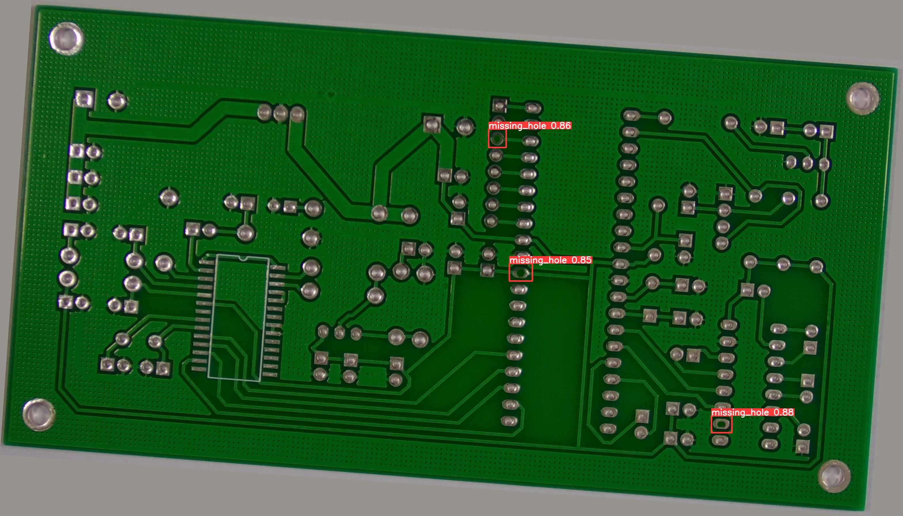
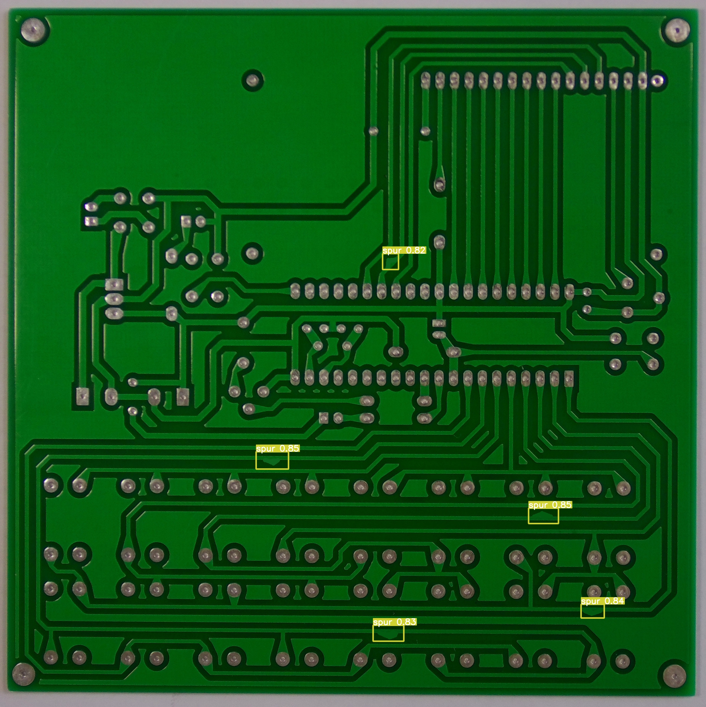

# PCB-Defect-Detection

簡單記錄如何使用YOLOv5偵測PCB版上的缺陷。
## 事前準備
如果沒有下載YOLOv5，可以先到以下網址安裝\
https://github.com/ultralytics/yolov5 \
下載完成後，將makeTxt.py跟voc_label.py移動至您的yolov5資料夾下；並在"yolov5/data/"資料夾中新增Annotations, images, ImageSets, labels等資料夾。

## 資料集處裡
我們使用labelImg將我們的資料集做標記，它會生成關於圖片資訊的xml檔，將其存放在"yolov5/data/Annotations/"。\
您可以在命令提示字元開啟labelImg
```
cd "you labelImg path"
python labelImg.py
```
由於YOLOv5在訓練時是使用txt進行訓練，因此，我們標記完成後，需要將xml轉換成txt。\
需要注意的是，在voc_label.py中的classes需要根據您的訓練而做更動，依據資料集的label而定。\
1.makeTxt.py 會將資料集分類成訓練資料集和測試資料集\
2.voc_label.py 將xml轉換成txt檔案
```
python makeTxt.py
python voc_label.py
```

複製"yolov5/data/"資料夾下的coco.yaml，並命名為"xxx.yaml"，將內容修改如下
```
train: data/train.txt
val: data/val.txt
test: data/test.txt

nc: 6                                                                                      // label數量
names: ['missing_hole', 'mouse_bite', 'open_circuit', 'short', 'spur', 'spurious_copper']  // label名稱
```

從"yolov5/models/hub/"找到所需的模型yaml檔，並移動至models下 (使專案我使用的是yolov5l6.yaml)。\
記得修改yaml中的nc，改成您專案的label數量。

## 新增資料集
如果您已經建立好資料集的xml，以下程式可以根據xml新增資料，例如:翻轉、平移、旋轉
```
python aug_with_bbox.py
```

## 訓練與測試
train:\
訓練完的模型存放在"yolov5/runs/train"。
```
python train.py --batch 4 --workers 0
```

test:\
執行結果存放在"yolov5/runs/detect"。
```
python detect.py --conf-thres 0.5
```

## 測試結果


